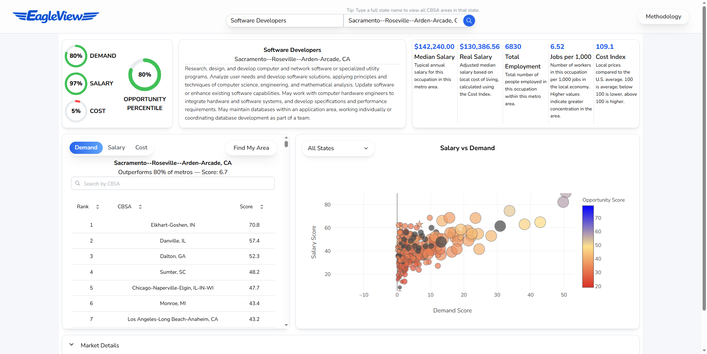
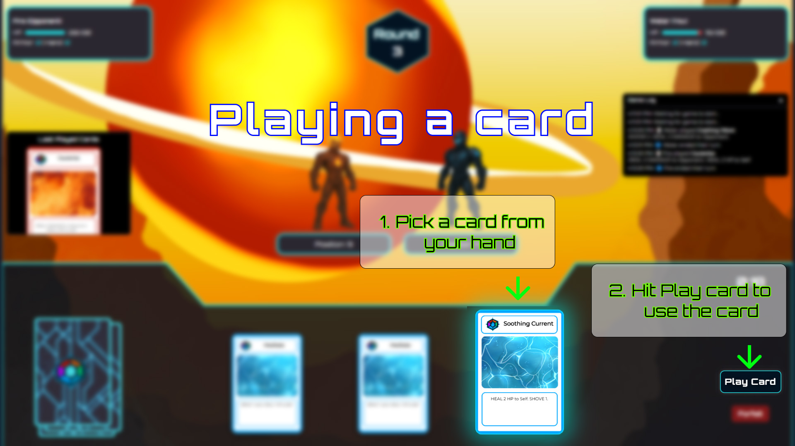
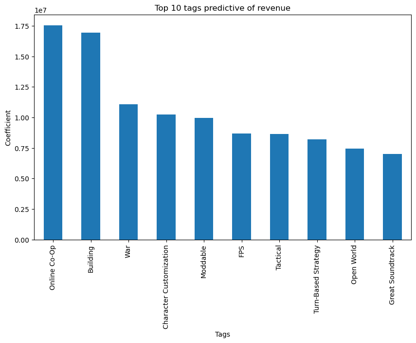

  <h1>Hi I'm Scott</h1>

<table style="border:none !important;">
<tr>
  <td width="50%" align="center" style="border:none !important;">
    
  </td>
  
  <td width="50%" align="left" style="border:none !important;">
    <h3>Building useful solutions with code.</h3>
    

      I'm a Computer Science graduate interested in building solutions that people actually need.  My interests are in building full-stack applications, working with data, and designing useful interactive experiences.  I   enjoy solving real problems and making information easier to understand.
    

    

      <a href="https://www.linkedin.com/in/scott-lam-28b99a3b0">LinkedIn</a> ·
      <a href="mailto:scottlam2001@gmail.com">Email</a>
    

  </td>
</tr>
</table>

## Featured Projects
### EagleView
EagleView was built around a simple idea: career decisions should be easier to make with useful information. It combines job demand, salary, and cost-of-living data into an interactive experience that helps users compare where their skills may have the most opportunity.

[View on GitHub](https://github.com/scottlam01/EagleView)

### Cores
Cores is a real-time multiplayer card game designed to make the core experience of traditional trading card games more approachable and easier to play.

[View on GitHub](https://github.com/scottlam01/Cores)

### Predicting the Next Big Game
Predicting the Next Big Game is a data science project that explores which game features are most associated with success on Steam. Using game reviews, critic scores, gameplay features, and other data, we built a predictive model to identify factors associated with higher revenue and user ratings.

[View on GitHub](https://github.com/scottlam01/Predicting-the-Next-Big-Game)

## Tech Stack

**Languages**  
Python, Java, C++, JavaScript, TypeScript, SQL, HTML, CSS

**Frameworks & Libraries**  
React, Spring Boot, Node.js, FastAPI, Pandas, NumPy, scikit-learn, Matplotlib, Seaborn

**Databases & Data**  
PostgreSQL, MySQL, MongoDB

**Cloud & DevOps**  
AWS, Docker, Kubernetes, GitHub Actions, CI/CD, Linux

**Development & APIs**  
Git, GitHub, Postman, REST APIs
